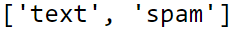
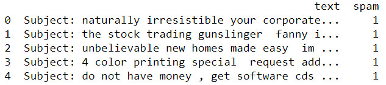

<!-- PROJECT TITLE -->
<h1 align="center">Email Spam Detection</h1>

<!-- HEADER -->
<p align="center">
  
</p>

<!-- PROJECT DESCRIPTION -->
## <br>**➲ Project description**
Email spam detection system is used to detect email spam using Machine Learning technique called Natural Language Processing and Python, where we have a dataset contain a lot of emails by extract important words and then use naive classifier we can detect if this email is spam or not.

<!-- PREREQUISTIES -->
## <br>**➲ Prerequisites**
This is list of required packages and modules for the project to be installed :
* <a href="https://www.python.org/downloads/" target="_blank">Python 3.x</a>
* Pandas 
* Numpy
* Scikit-learn
* NLTK

Install all required packages :
 ```sh
  pip install -r requirements.txt
  ```

<!-- THE DATASET -->
## <br>**➲ The Dataset**
Human activites dataset contain about 5728 record which is a sample of an email<br>
and a target column "type" which describe the state of an email spam or not.<br>
<br>**Dataset features and target :**<br>
<br>
<br>**Dataset head :**<br>


<!-- CODING SECTIONS -->
## <br>**➲ Coding Sections**
In this part we will see the project code divided to sections as follows:
<br>

- Section 1 | Data Preprocessing :<br>
In this section we aim to do some operations on the dataset before training the model on it,
<br>processes like :
  - Load dataset
  - Check for duplicates and remove them 
  - Check for missing data for each column 
  - Cleaning data from punctuation and stopwords and then tokenizing it into words (tokens)
  - Convert the text into a matrix of token counts
  - Split the data into training and testing sets<br><br>

- Section 2 | Model Creation :<br>
The dataset is ready for training, so we create a K-nearest Neighbors "KNN" model using scikit-learn and thin fit it to the data.<br>

- Section 3 | Model Evaluation :<br>
Finally we evaluate the model by getting accuracy, classification report and confusion matrix.

<!-- INSTALLATION -->
## ➲ Installation
1. Clone the repo
   ```sh
   git clone https://github.com/omaarelsherif/Email-Spam-Detection-Using-Machine-Learning.git
   ```
2. Run the code from cmd
   ```sh
   python email_spam_detection.py
   ```

<!-- OUTPUT -->
## <br>**➲ Output**
Now let's see the project output after running the code :

**Dataset head :**<br>
<br><br>

**Dataset missing data count :**<br>
<br><br>

**Dataset after cleaning puncituations and tokenizing text :**<br>
<br><br>

**Classification report, confusion matrix and accuracy :**<br>
<br>

<!-- REFERENCES -->
## <br>**➲ References**
These links may help you to better understanding of the project idea and techniques used :
1. Spam detection in machine learning : https://bit.ly/3nwiKtA
2. Naive-bayes algorithm : https://bit.ly/3zc9SLH
3. Model evaluation : https://bit.ly/3B12VOO

<!-- CONTACT -->
## <br>**➲ Contact**
- E-mail   : [omaarelsherif@gmail.com](mailto:omaarelsherif@gmail.com)
- LinkedIn : https://www.linkedin.com/in/omaarelsherif/
- Facebook : https://www.facebook.com/omaarelshereif
